# ⚡🩺 DISEASE PREDICTION & TELEHEALTH PLATFORM


<p align="center">
  
  
  
  
</p>

---

> 💊 **AI-Powered Diagnosis meets Real-Time Telehealth**
> ⚡ Built for speed, accessibility, and modern healthcare workflows

---

# 🌌 ░▒▓ OVERVIEW ▓▒░

A **full-stack cyber-ready healthcare platform** that merges:

```
⚡ Machine Learning → Disease Prediction
💬 Real-Time Chat → Doctor Consultation
📅 Smart Scheduling → Appointment Booking
```

🧠 Enter symptoms → Get predictions → Connect with doctors instantly

---

# 🚨 ░▒▓ PROBLEM ▓▒░

```
❌ Limited healthcare access
❌ Expensive consultations  
❌ Long waiting times
❌ Rural accessibility issues
```

---

# ⚡ ░▒▓ SOLUTION ▓▒░

```
✔ Instant ML predictions
✔ Remote doctor access
✔ Real-time chat system
✔ Digital appointment workflow
```

---

# 🧠 ░▒▓ FEATURES ▓▒░

## ⚡ ML ENGINE

* Symptom-based prediction
* Pre-trained scikit-learn model
* Fast inference via joblib

## 👤 AUTH SYSTEM

* Separate login:

  * Patient
  * Doctor
  * Admin

## 🧑‍⚕️ PATIENT MODULE

* Disease prediction
* Appointment booking
* Consultation history
* Profile system

## 🏥 DOCTOR MODULE

* Dashboard
* Patient tracking
* Consultation management

## 💬 CHAT SYSTEM

* Patient ↔ Doctor messaging
* Consultation-based interaction

## 📅 APPOINTMENTS

* Time-slot scheduling
* Doctor mapping

## 🎨 UI SYSTEM

* Bootstrap responsive UI
* Mobile-friendly design

---

# 🧬 ░▒▓ SYSTEM FLOW ▓▒░

```
[ User Symptoms ]
        ↓
[ ML Model ]
        ↓
[ Disease Prediction ]
        ↓
[ Doctor Consultation ]
        ↓
[ Chat + Appointment ]
```

---

# 🧰 ░▒▓ TECH STACK ▓▒░

| Layer       | Tech                  |
| ----------- | --------------------- |
| ⚙ Backend   | Django 3.0.3          |
| 🧠 ML       | scikit-learn          |
| 💾 Storage  | joblib                |
| 🗄 DB       | SQLite                |
| 🎨 Frontend | HTML + Bootstrap + JS |
| 🔐 Auth     | Django Auth           |

---

# 📸 ░▒▓ LIVE DEMO ▓▒░

| Role | Login | Dashboard | Key Features |
|------|-------|-----------|--------------|
| **Patient** | 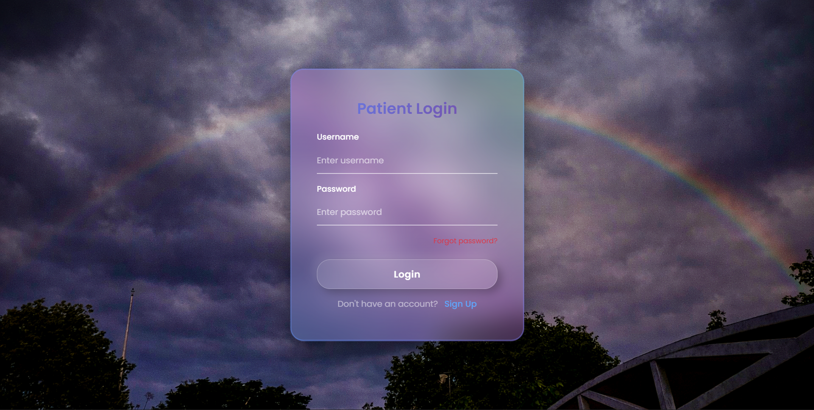 | 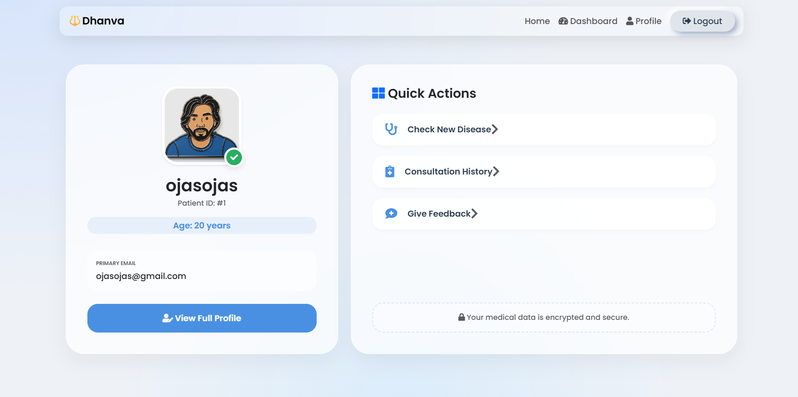 | 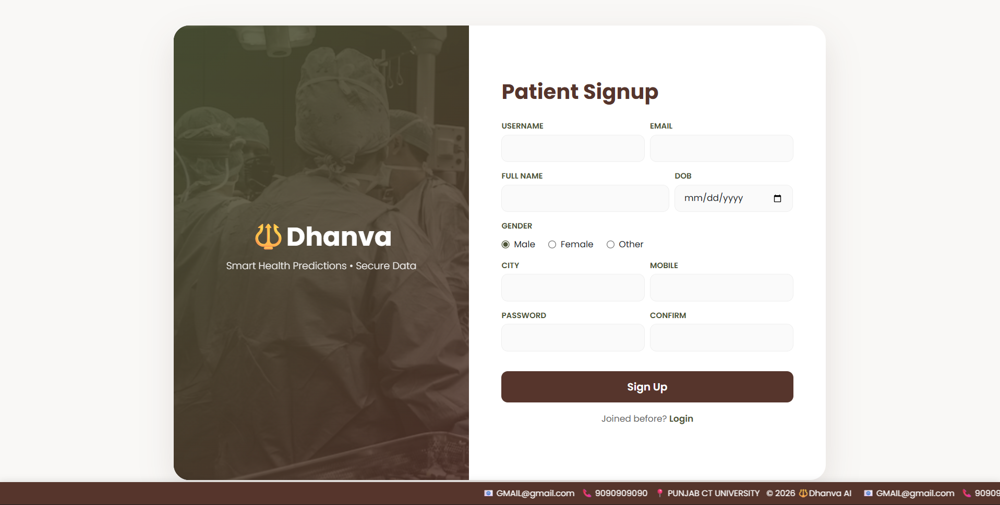 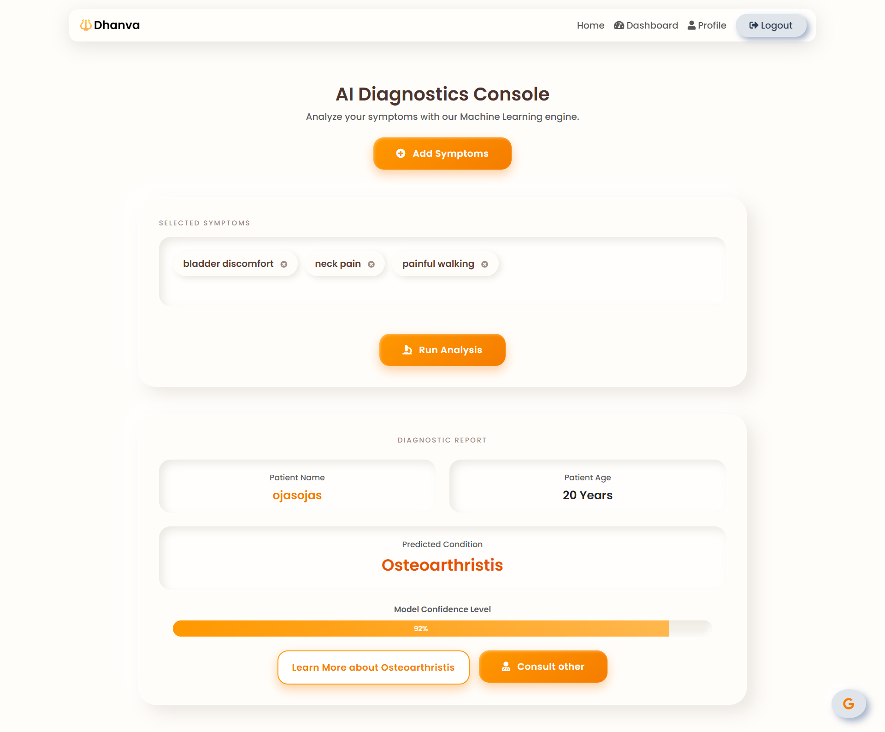 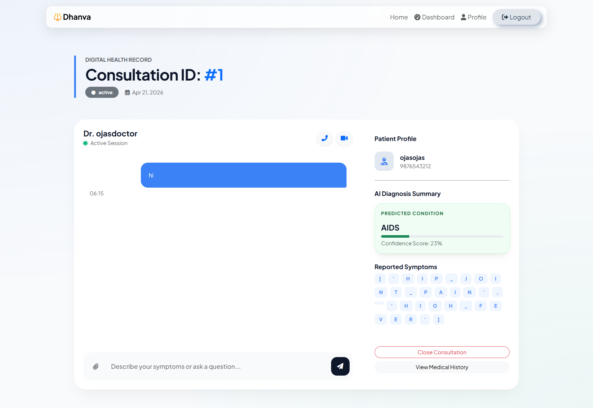 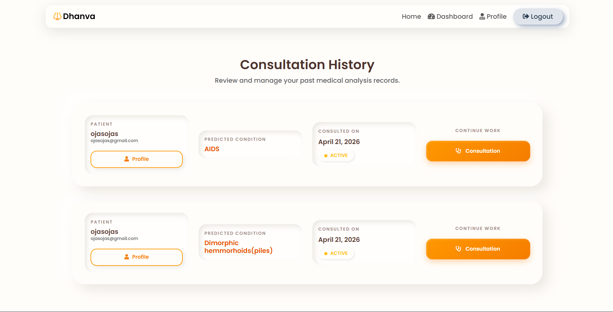 |
| **Doctor** | 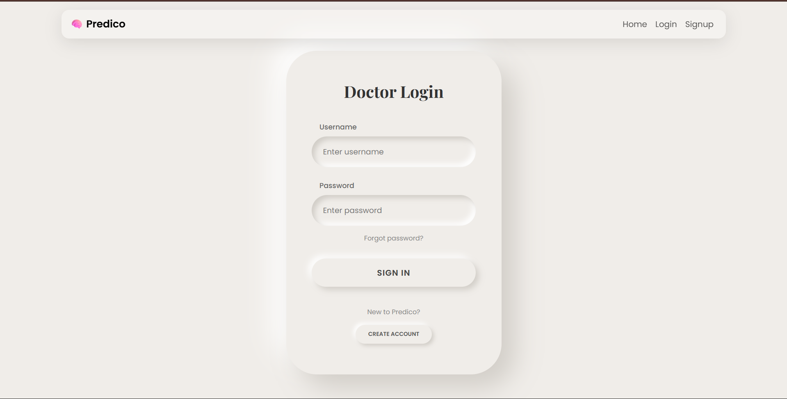 | 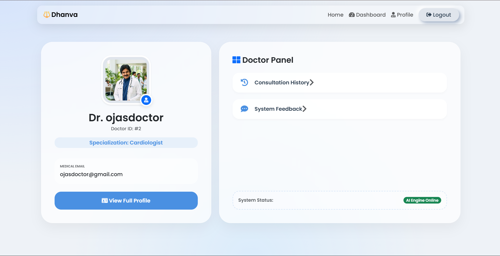 | 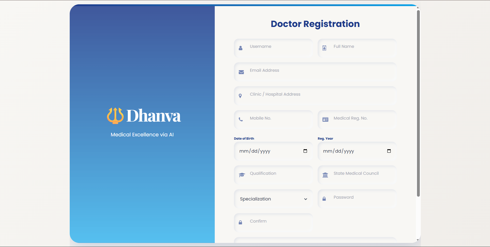 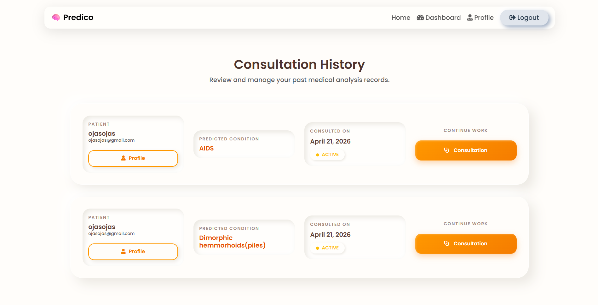 |
| **Admin** | 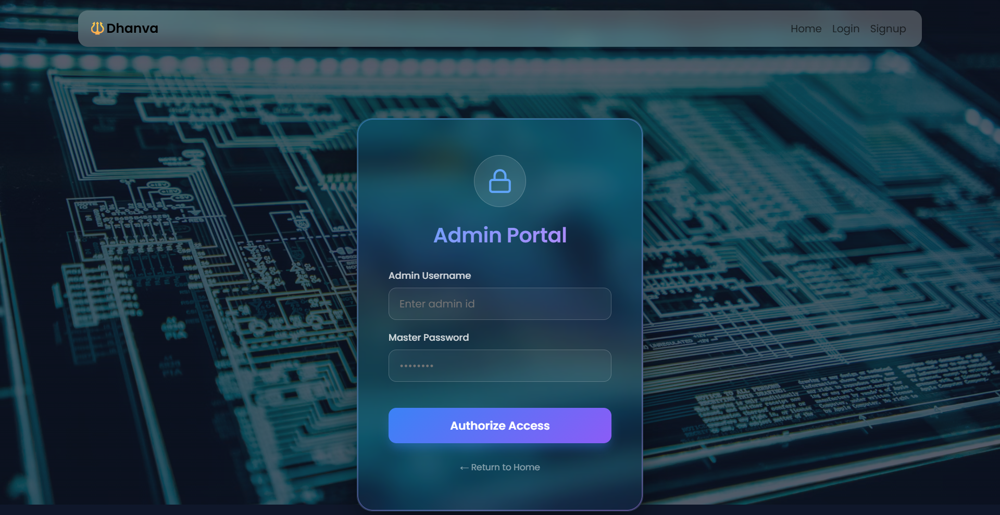 | 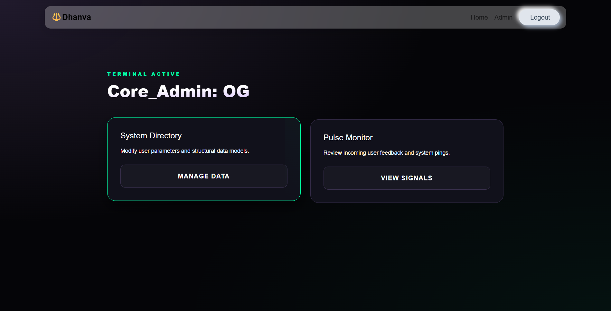 | Django Admin |

---

# 📂 ░▒▓ PROJECT STRUCTURE ▓▒░

```
Disease-Prediction/
│
├── manage.py
├── requirements.txt
│
├── disease_prediction/
│   ├── settings.py
│   ├── urls.py
│
├── accounts/     # Authentication
├── main_app/     # Core logic
├── chats/        # Messaging
│
├── templates/    # UI
└── screenshots/  # Demos
```

---

# ⚙️ ░▒▓ INSTALLATION ▓▒░

```bash
git clone <repo>
cd Disease-Prediction

python -m venv venv
source venv/bin/activate  # Linux/macOS
# venv\Scripts\activate  # Windows

pip install -r requirements.txt

python manage.py migrate
python manage.py createsuperuser
python manage.py runserver
```

🌐 **http://127.0.0.1:8000/**

---

# 🔑 ░▒▓ LOGIN CREDENTIALS ▓▒░

| Username | Password | Role |
|----------|----------|------|
| `ojas` | `1234` | Patient |
| `ojasdoctor` | `1234` | Doctor |
| `admin` | `1234` | Admin |

---

# 📊 ░▒▓ ML MODEL ▓▒░

* **Input:** Symptoms
* **Output:** Disease prediction
* **Dataset:** Kaggle Disease Prediction

---

# 🌐 ░▒▓ ROUTES ▓▒░

| Endpoint | Description |
|----------|-------------|
| `/` | Homepage |
| `/login/` | Auth |
| `/predict/` | ML |
| `/chat/` | Messaging |

---

# ⚠️ ░▒▓ STATUS ▓▒░

```
✅ ML Prediction
✅ Authentication  
✅ Chat System
🔄 Appointments
🔄 Enhancements
```

---

# 🤝 ░▒▓ CONTRIBUTING ▓▒░

```bash
fork → branch → commit → PR
```

---

# 📜 ░▒▓ LICENSE ▓▒░

**Apache 2.0**

---

# 👨‍💻 ░▒▓ AUTHOR ▓▒░

[Your GitHub]

---
⚡ **Cyberpunk Healthcare** ⚡

# disease-prediction-Dhanva
# disease-prediction-Dhanva
